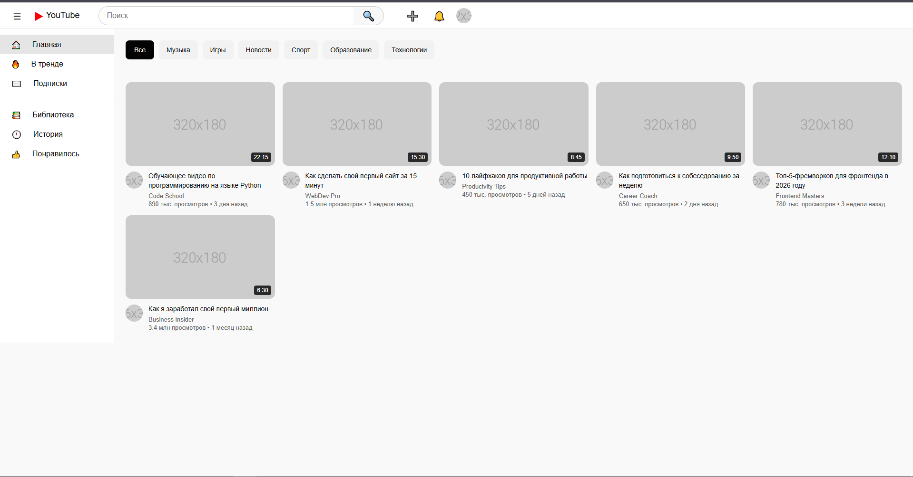
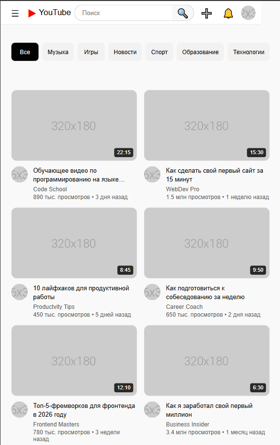

# YouTube Clone - Лабораторная работа №10-11

**Студент:** Тотьмянин Тихон Алексеевич
**Группа:** ИСП-232

## Описание
Адаптивный клон главной страницы YouTube, созданный с использованием HTML, CSS, Flexbox и CSS Grid. Проект включает полноценную шапку с поиском, боковую навигационную панель, интерактивные категории (чипсы) и сетку видео-карточек с hover-эффектами. Верстка полностью адаптивна под все устройства от десктопа до мобильных телефонов.

## Реализованные функции
- [x] Адаптивный хедер с поиском
- [x] Боковая панель навигации
- [x] Категории (чипсы) с интерактивностью
- [x] Сетка видео с карточками
- [x] Hover-эффекты на карточках
- [x] Полная адаптивность под все устройства
- [x] Плавные анимации при наведении
- [x] Кастомный скролл для категорий
- [x] Разделы с видео (Рекомендуемое, Подписки)
- [x] Кнопка "Наверх"

## Технологии
- HTML5
- CSS3
- Flexbox
- CSS Grid
- Media Queries
- CSS Transitions

## Скриншоты
### Desktop (1920px)

### Tablet (1024px)

### Mobile (375px)

## Как запустить
1. Откройте файл `index.html` в браузере.
2. Или используйте **Live Server** в VS Code:
   - Установите расширение Live Server
   - Правой кнопкой по `index.html` → Open with Live Server

# Структура проекта

## Вывод
В ходе выполнения лабораторной работы я изучил основы адаптивной верстки, освоил работу с Flexbox для построения шапки и боковой панели, применил CSS Grid для создания автоматической сетки видео-карточек. Я научился создавать интерактивные элементы с помощью CSS-псевдоклассов (hover, focus, active), реализовал плавные анимации с использованием transition и transform. Проект помог мне лучше понять принципы создания современных веб-интерфейсов и их адаптацию под различные устройства с помощью медиа-запросов.

## Дата выполнения
[Дата завершения работы, 13.02.2026]